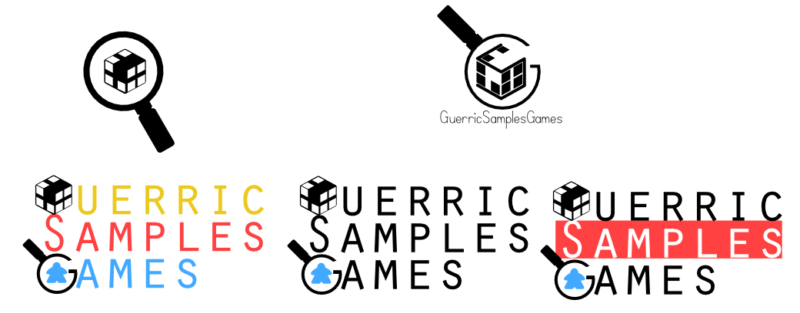

I've been using 2d image editing software since I was about 10 years old, when I would make silly photo edits to share with friends.
As time went on the skills and art fundamentals I was applying remained consistently useful, to the point that I'm more comfortable drawing 
with mouse & keyboard than I am with a pencil.

I'm familiar with both raster and vector editing software, primarily Adobe and Affinity.
I have also used Aseprite for my game jam projects.

## Photo Manipulation

"Silly photo edits to share with friends" remains the majority of my photo-manipulation _oeuvre,_ 
though I've also done digital re-touching and colour balancing on private personal photos using those same skills.

[Leder Games](https://ledergames.com/) has long resisted calls to release an all-encompassing "big box." 
I posited that as an act of spite they should release a spherical "ROOT ORB", inimicable to the shelves of all who bought it.
Three images were combined for this project - The board game shelf, Root box, and the falling game in the foreground.

## Digital Collage

I've always been fascinated by political propaganda as an art form. That likely says as much about me as propaganda posters say about their original creators.
Creating thumbnails for my Youtube videos offered a chance to study various forms of propaganda across history, as well as reflecting the identities of the 
game factions discussed in the video.

 

The underdog "Corvid Conspiracy" faction follows a fragile, insurgent gameplan reliant on misdirection. 
The patchwork style of Punk-era 'zines (with some help from _Across the Spiderverse_) seemed an ideal fit.
Working with so many paper textures was a challenge; the dense details made it difficult to select and colour, while also muddling the visual hierarchy.
High-contrast colours, drop shadows, and desaturated guiding lines with thick hand-painted outlines hold the piece together, and I'm very happy with how it turned out.

 

One of my earlier videos, this thumbnail takes direct inspiration from Leninist industrial propaganda. Strong guiding lines lead the figures forward at the urgings of a 
commanding central figure. At this point, I was still constrained to working within the paper "poster frame" layout in order to maintain visual consistency for my guide series.
The red "Gittin Gud!" banner is handmade, and one of my better moments in colour selection. Shame it takes up too much room to be re-usable...

The "Riverfolk Company" faction represents corporate capitalist power in the game's setting. I felt it was only fitting that they be represented through corporate propaganda,
in the form of an homage to magazine cigarette ads. I include this example as something with a lot of room for improvement.
The sloppy selection lines around the focal character were a side-effect of time crunch, but the greater sins are the static, boring composition and reliance on text to explain the joke.
The visual identity of advertising focuses, unsurprisingly, on the product - few ads exist whose visual identity remains intact if the focal subject is swapped out.
Fewer still exist that don't rely on reams of aggrandizing text, static composition, and giant logos, elements that translate poorly to tiny video thumbnails.

## Pixel Art

I picked up Aseprite in order to participate in game jams. Now I look to it for any 2d game project.

["Cafe Nigredo"](https://hops1595.itch.io/cafe-nigredo) was my first game jam project, as well as my first experience with Aseprite. I created all of the art seen in the game.
The cartoonish style was informed by the larger 100x200 sprite scale chosen by our team lead. Working at this scale freed us from the constraints of true "pixel" illustration
at the cost of needing more detail to fill the expanded space. 
Our narrative of a petty rivalry escalating to cthonic sabotage is told through slideshow cinematics and environmental elements filled with my brand of irreverent humour.
Our team worked together wonderfully, and in  submitting it to [Pirate Jam 15](https://itch.io/jam/pirate15/rate/2864835) we reached a popularity ranking of **19th out of 2,374 entries.**

## Twitch/Discord Emotes

One of the more direct applications of my experience has been in creating emotes for Discord and Twitch. 
I often use Affinity Designer for these, as vector images make for cleaner output.

I used the project of designing unprompted logos for a friend's Twitch stream as a project to initially learn how to use Designer.
I eventually landed on this design, which I felt effectively condensed the channel name and content into something where the text was optional:

These custom emotes were created for the "Woodland Warriors" podcast, and the "Palia" discord server.

[back](./)
