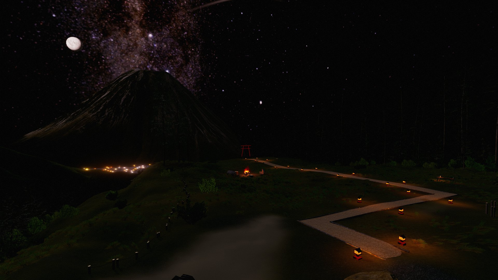
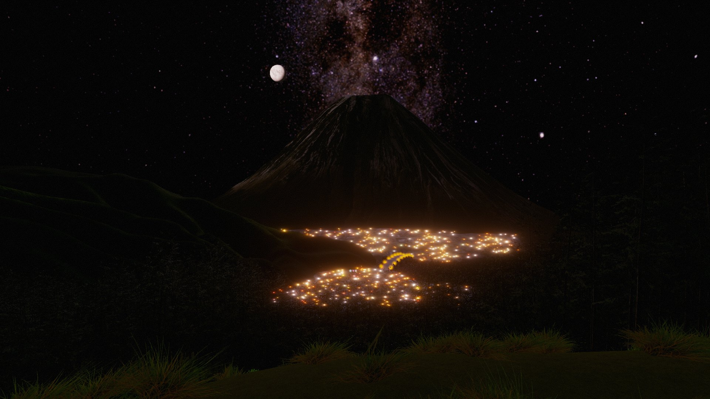
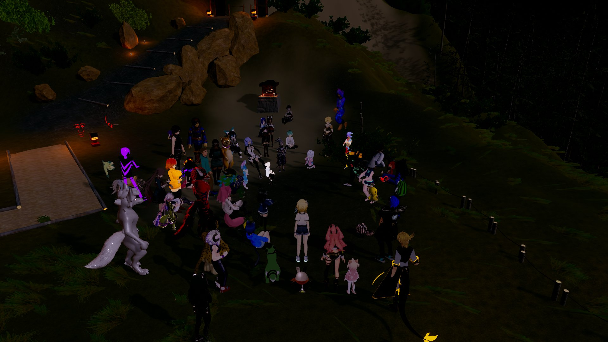

I began properly learning to use Blender in order to create content for Tabletop Simulator.
I've since expanded that experience with gamedev projects, primarily in Unity.

## Game Jams

For Pirate Jam 16, I acted as tech artist for ["GUNGUS GO GET"](https://itch.io/jam/pirate16/rate/3289632), a game that was largely unfinished due to planning and technical issues.
Conflicts with Github and Unity destroyed any hope of collaborative version control, and I ended up working until 4am the night before submission to implement as much content as possible and
iron out stability and control issues.

Up to that point however, I created most of the textures and environment models for the game:

Over the span of about four days I modelled, textured, and implemented 17 objects, as well as creating and painting textures for the terrain mesh.
During the push to solve our version control issues, I handled Unity implementation for the game's sound effects and models.

## Moonrise Over the Sky Gate

This project was a [VRChat level](https://en.vrcw.net/world/detail/wrld_b763d676-fbaa-416b-8777-82237a2352b2) I designed as a gift for a friend of mine.
They had expressed interest in visiting [Tenku no Torii](https://japanjourneys.jp/yamanashi/kawaguchiko/attractions/tenku-no-torii/), but were put off by reports of the site being an unabashed tourist trap with abrasive owners.

I put the level together over the better part of two weeks, owing largely to unfamiliarity with VRChat's API. The level is a scenic overlook with gentle music,
seating, a fire, intermittent meteorites, and a few popular VRChat elements like mirrors. 
The glowing cityscape is achieved through a transparent texture with high emission, and the moon and Mt. Fuji models are from online sources. 

I debuted the level to VRChat's wonderful level creation community, who gave me a warm reception and a gentle reminder never to use sprites for grass foliage in a VR game, as they're profoundly disorienting.
I do not own VR hardware.

## Tabletop Simulator Optimizations

TTS is an old game with pretty limited developer support, yet its market dominance makes it the de facto platform for board game developers to prototype new content.
These prototypes frequently become part of the game's official mod upon release, without ever undergoing performance optimizations. This often leads to mods that take
a long time to load, and which encounter frequent stability issues as TTS's netcode isn't especially robust.

On a few occasions, I've taken the opportunity to offer optimized assets myself to developer teams. Most recently with [The Old King's Crown](https://www.theoldkingscrown.com/).
The production pipeline for 3d assets is as follows:

1. Identify the most resource-intensive assets.
2. Identify assets with shared textures, or where texture atlasing can be applied. Meeples are the most common case here.
3. In image-editing software, create atlased textures for relevant pieces, and reduce image scale to a reasonable size.
4. Import 3d models to blender, reduce their vertex count with modifiers, triangulate faces, and remap their UVs with the atlased texture.
5. Import the models and textures into Unity, crunch-compress the images, and export the models and materials as separate AssetBundles
6. Import the AssetBundles into TTS, sharing the atlased textures among the related models.

In the case of TOKC, this one-inch meeple had over 14,000 tris, a 4096px uncompressed texture, and a uncompressed 4096px diffuse map; it is one of 15 such meeples in the mod.
During my testing with caching disabled, my optimizations improved load time from 1m45s -> 22s.
Since I offered these changes unprompted, the choice to implement them in the mod is one I leave to the official mod team.

## A silly, Overdesigned Joke

Okay, look.
I know full well a portfolio should be _professional._ Showcasing your best work with pride and confidence.
But sometimes you spent so long on a joke for your friend that it arguably qualifies as work experience.

Once I knew how to make Unity AssetBundles, the temptation to represent my friend in a meme that was outdated even by the standards of its time was irresistible;
especially since I could unveil it on his Twitch stream.

The original textured 3d model was acquired from Sketchfab, and is attributed to ["RenderPeople"](https://renderpeople.com).
The animation is taken from an FBX asset rip of fortnite; I did not record the original source.
I overlaid the original texture with my friend's face and other graphics, and sculpted the head to better match his appearance.
The model was then rigged with blender's automatic rigging system, which I then tweaked for accuracy in Unity. This also involved renaming the armature to match the animation.

The final product is functional in tabletop simulator, with both idle and dancing animations that can be toggled. 

[back](./)
