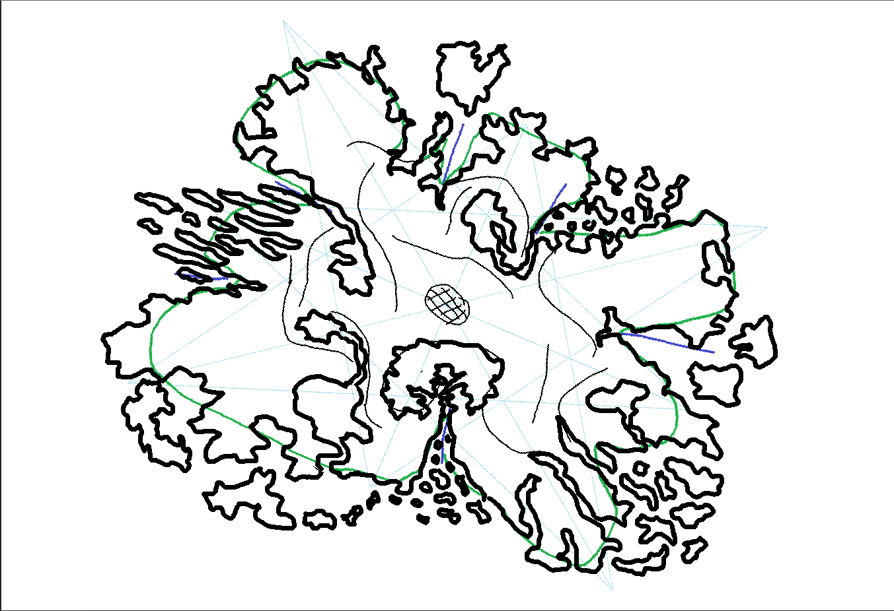

Just like the rest of the planet, I'm a big fan of _Minecraft._ There was one roleplaying community I was a part of from about 2013 - 2020,
an experience that is comparable to Dungeons and Dragons set within the context of Minecraft.
This was the largest personal project I have undertaken to date, and I undertook all of it while fulfilling my role as a Storyteller (read: admin) at the same time.

## Background

In 2018 the server launched their 11th world map; a significant occurrence that must occur regularly to refresh player interest. This new map was a vast archipelago measuring 22k x 22k blocks,
a goliath scale considering most regular players of the game will rarely venture beyond 1000 blocks of their spawn point. Several issues became swiftly apparent:

1.  The map had unintentionally been generated without caves, resulting in _obscene_ nighttime mob spawn rates on the surface.
2.  The vast scale of the map severely isolated the player groups, and left much of the terrain under-populated.
3.  Heavy reliance on boat travel meant rapidly loading many chunks for long periods of time, exacerbating Minecraft's memory leaks to the point of making the game nearly unplayable for anyone online.
4.  A storyline that heavily pushed inter-factional conflict led to a cold war that put unprecedented stress on the playerbase.
5.  Availability issues and burnout among volunteer Storytellers led to most story content being frozen for months with no relief in sight.
6.  In an effort to ignite the cold war conflict, some players were operating a campaign of gaslighting and antagonism to further drive a wedge between factions.

These problems led to a rapid decline in average player count, and a serious increase in toxicity. At its worst, the server had a core player count of three with out-of-character global chat being used primarily for screaming matches.
Seeing the bleak state of the server, i volunteered to become a Storyteller for the first time in my tenure with the community and offered a plan to fix the situation.

## The Plan

I offered the following plan to the server owner:

After nine months of uptime, the 11th world had played out all of its prospective value and needed to come to an end. A clean slate will drive new interest, 
and we can learn from our mistakes to prevent them from re-occurring. However, a properly-designed map will take significant time to make; longer than we're willing to make people wait.

My proposed plan was as follows:

1.  Create a placeholder map we can launch within the week. Rather than an isolating expanse players will be encased in a massive stone cube, forcing them to closely cohabitate.
2.  All players on this placeholder map are from the same faction. They can split off organically if they like, but everyone starts out as friends.
3.  The storyline is light, loose, and inclusive of player desires. As part of the storyline, players can reprise old characters from previous worlds if they like.
4.  The stone cube map is riddled with diverse cave layers containing various resources. Not only will this make the map more interesting, but these cave layers will be useful when creating the properly-designed map.
5.  Maintain player interest in this 12th map until the 13th is ready.

I created this "Cubeworld" in 3 days, a 4k x 4k stone box encased in unbreakable bedrock with 11 unique cave layers. The map itself was an outright success, with the core player population rebounding from it's nadir of 3 to an all-time high of roughly 80 players.
This map also broke the community's all-time record for concurrent online players, with a record of 51.

## Nebelloren

Over the course of next nine months I designed and created the entirety of the 13th map, which would come to be named "Nebelloren." I also designed a plurality of the map's gameplay features,
and implemented them with the assistance of other server staff. The core tenets of Nebelloren were as follows:

*   A single contiguous continent, large enough that travel is a committment without being onerous. (8k x 6k blocks)
*   Traversal of the map will be complicated by natural terrain barriers and custom biome effects, rather than distance alone.
*   Every map biome features some degree of sub-biomes within it.
*   Using the popular "far" render distance, you should always be able to see something interesting no matter where you're standing.
*   The ocean floor will have content. (This was prior to Mojang's official ocean update.)
*   Each biome will have unique underground cave biomes beneath it.
*   Natural resources will be localized to certain biomes, incentivising exploration and trade.
*   Each biome should have a distinct identity, and transitions between them should be obvious.

<iframe width="560" height="315" src="https://www.youtube.com/embed/SnOQU1qQAaw?si=IqOOsgHirbf4PF4y" title="YouTube video player" frameborder="0" allow="accelerometer; autoplay; clipboard-write; encrypted-media; gyroscope; picture-in-picture; web-share" referrerpolicy="strict-origin-when-cross-origin" allowfullscreen></iframe>

_The final Nebelloren map, as seen in WorldPainter._

In the 12 years the community has existed, most of their 12 prior maps lasted less than six months. Nebelloren (or a modified version of it) has been their map for nearly six years.

The map terrain is hand-painted in Worldpainter using a variety of GIS heightmaps, online terrain brushes, and WorldMachine brushes of my own creation.
Every biome in minecraft is represented, and every resource found in the vanilla 1.18 overworld can be found on my map.

I and the staff team created a suite of custom player classes and abilities befiting the server lore. To further encourage exploration and trade, I updated the abandoned "PwnPlantGrowth" plugin
for our version, which allowed us to limit the growth of certain plants to specific biomes. 
Many of the biomes apply mildly-harmful potion effects that are circumvented by different playable races, to encourage cooperation between players.

While designing the map's layout, one of my core goals was to ensure that it was impossible to traverse the map in a straight line without encountering _some_ kind of terrain barrier.

This image from the planning phase shows the placement of mountains, cliffs, and the dangerous central volcano biome. The entire map is surrounded by "Deep ocean" which applies dangerous damage-over-time, to constrain the playable space while giving us room to add content to the map in the future.

[back](./)
